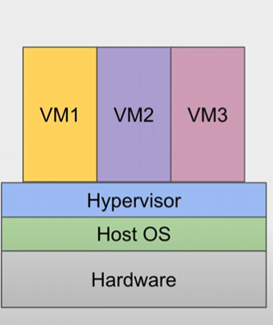
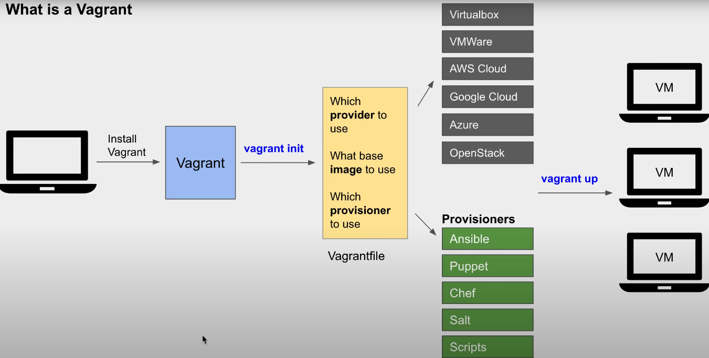

# DevOpsCourse

Vagrant
A virtual machine is a software-based computer that runs inside another physical computer, called the host machine.
The VM is created and managed by a special software called a hypervisor, which is installed on the host machine.
Hypervisor provides mechanisms for sharing the physical resources of the host machine among multiple VMs, so that each VM can have its own isolated and secure environment.

VM Platforms:
•	VirtualBox
•	Amazon EC2
•	Microsoft Azure
•	Google Cloud Compute Engine

What is Vagrant?
Vagrant is an open-source software product for building and managing virtual machine environments in a single workflow. In simpler terms, it's a tool that helps you create and manage virtual machines (VMs) for development, testing, and other purposes, all from the command line and using a simple configuration file(Vagrant File).

How Vagrant works?

After installing vagrant, we run the vagrant init command, which is a fundamental command in Vagrant, used to initialize a new Vagrant environment in our current working directory. In addition it automatically creates a vagrant file. This vagrant file inside will contain the following, which provider to use, which base image to use as well as which provisioner to use.

